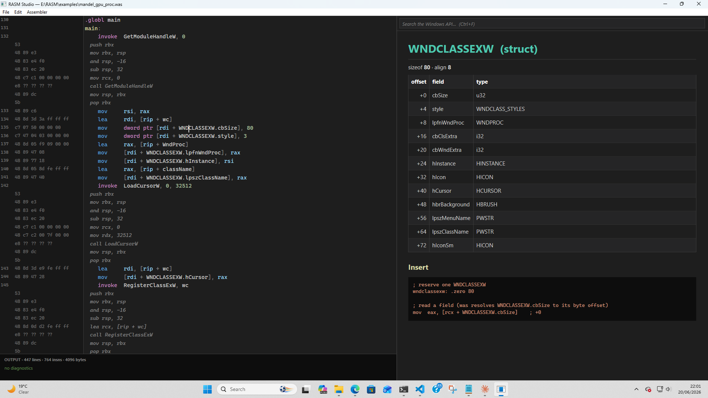

# WRASM

### Powerful assistance that conceals nothing



A from-scratch, self-contained **x86-64 assembler for Windows** — and the
knowledge-driven IDE growing around it. No LLVM, no JIT, no external linker:
source text goes in, a running `.exe` comes out.

Four things make it different:

- **Byte-identical to LLVM-MC.** The encoder is validated against LLVM as a
  differential oracle across integer, SSE/SSE2, AVX/AVX2 (VEX) and AVX-512
  (EVEX). A frozen corpus of 5,109 goldens gates every build — with no LLVM
  present at test time.
- **It knows Windows.** A read-only knowledge layer over a ~165,000-symbol
  database (functions + parameter types, constants, enums, struct layouts with
  byte offsets, and COM IIDs, vtable slots, and method parameter types) means you
  write `invoke CreateFileW, …`, `sizeof(RECT)`, `RECT.right`, and
  `pDevice.CreateRenderTargetView(…)`, not magic numbers.
- **Structured asm you can trust — automate the tedium, show every byte.**
  Data-aware macros (`invoke`, `comcall`/`comobj`, `iid`, `struct` instances) and
  a declared-subroutine convention (`proc … endproc` with `uses`/`in`/`out` and an
  opt-in `frame`) expand to *visible* instructions — never hidden codegen. The
  contract then *checks* what you declared: a callee-saved register clobbered
  across a call, an `in`/`out` mismatch, a stack left off the aligned frame.
- **Self-contained output.** It emits COFF `.obj` files *and* complete PE `.exe`
  files with their own import directory and thunks — no `link.exe` required.

> Status: the core (source → `.exe`) is complete and byte-identical to LLVM-MC.
> The authoring layer — the COM macros, the `proc`/`frame` convention and its
> contract/clobber checks, float→`xmm` marshaling, `.include`, `.ASCIISTRING` —
> is in and unit-tested. A growing demo corpus exercises it end to end: GDI
> framebuffers, a D3D11 shader Mandelbrot with rubber-band zoom, a Direct2D
> particle fountain, and the start of a retro indexed-colour game canvas. The IDE
> serves cards, live checks and builds from one headless language thread.

## Workspace

| crate | what it is |
|-------|------------|
| **`rasm`** (root) | The x86-64 encoder (Intel-syntax text → bytes), plus the COFF `.obj` and self-contained PE `.exe` writers, the differential-test corpus, and the `rasm-as` CLI. |
| **`winkb`** | The knowledge layer: a read-only API over `windows_api.db` (search, resolve, function + COM-method signatures, struct layouts, interfaces, snippets, did-you-mean). `winkb` CLI. |
| **`was`** | The Windows assembler front-end: rewrites a thin, *transparent* superset of Intel asm into rasm text, then assembles. `invoke`/`comcall`/`comobj`/`iid`, `struct` instances, `Struct.field`, `sizeof(T)`, `proc`/`frame`, `.if`/`.while`, `.ASCIISTRING`, `.include` — all expanding to instructions you can see, with the contract checks on top. `was` CLI (`.obj`/`.exe`/`--check`). |
| **`ide`** | The assistant as *content*: turns a winkb query into renderable markdown cards (functions with arg→register marshaling, structs, COM methods, registers + ABI, instruction/flags, the `proc` convention, your own local symbols), and models the interactive insert frame. GUI-free and unit-tested. `ide-card` CLI. |
| **`studio`** | The IDE front-end: the [language thread](crates/studio/src/lang.rs) (all `!Sync` state on one worker, message-passed), the live-check/ghost-byte seam, caret cards, and autocomplete. `studio-repl` drives the whole stack from a terminal. |

## The authoring layer

Everything below lowers to plain, visible x86-64 — inspect it with `was … --emit-asm`.

- **`invoke F, a, b, …`** — Win64-ABI marshaling from the db signature (shadow
  space, arg→register, **float args to `xmm` automatically** from the param type).
- **COM, the data-aware way** — `comobj p : ID3D11Device` then
  `p.CreateRenderTargetView([rip+tex], 0, pRTV)`; vtable slot, struct offsets, and
  `iid ID3D11Texture2D` GUIDs all come from the db.
- **`struct LABEL TYPE … ends`** — a struct instance laid out at the db's byte
  offsets (`BufferDesc.Width = 1280`).
- **`proc NAME uses … in … out … [frame] … endproc`** — a declared subroutine:
  visible prologue/epilogue, and the contract is *checked*. `frame` reserves the
  shadow/alignment once so the calls inside go lean. The caller-side **clobber
  check** warns when a value in a volatile register is destroyed across a call.
- **`.ASCIISTRING … .ENDASCIISTRING`** — embed raw text (HLSL shader source, say)
  verbatim; **`.include "file"`** — compose a program from many files.

## Build & test

**Prerequisites:** Rust stable 1.80+ (`rustup` — https://rustup.rs) · Windows 10/11
64-bit (the IDE uses Direct2D / DirectWrite; the assembler and tests are
cross-platform but the GUI is Windows-only).

All Rust crates (assembler, IDE, knowledge layer, and the Direct2D render core)
are vendored under `crates/`. A fresh `git clone` + `cargo build` is all you need:

```sh
git clone https://github.com/albanread/WRASM.git
cd WRASM
cargo build                  # everything: rasm + winkb + was + ide + studio
cargo test -p rasm           # encoder unit tests + the 5,109-golden corpus gate
cargo test -p was            # front-end: macros, proc contracts, clobber checks
cargo test --workspace       # full suite across all crates
```

### The knowledge database

`winkb`, `was`, and `studio` read `windows_api.db` — a SQLite database of
~165,000 Win32 symbols (functions, types, struct layouts, constants, COM
interfaces) derived from the official Microsoft Win32 metadata. It is not
committed to this repo (86 MB uncompressed, 20 MB zipped).

**Option A — download the pre-built copy** (quickest):
Download `windows_api.zip` from the [Releases page](https://github.com/albanread/WRASM/releases),
extract `windows_api.db` anywhere convenient, and set `WINKB_DB` to point at it.
A pre-built copy derived from Win32Metadata 70.0.11-preview is available there now.

**Option B — build it yourself** (see [Building the knowledge database](#building-the-knowledge-database) below).

Point `winkb`/`was`/`studio` at your copy with the `WINKB_DB` environment variable:

```powershell
# PowerShell — current session
$env:WINKB_DB = "C:\path\to\windows_api.db"

# PowerShell — permanent (new shells)
[System.Environment]::SetEnvironmentVariable("WINKB_DB","C:\path\to\windows_api.db","User")
```

```cmd
rem cmd
set WINKB_DB=C:\path\to\windows_api.db
```

The assembler core (`rasm`), the front-end (`was --check` excluded), and all
encoder tests work without the database. Only lookups, `invoke`, `comcall`,
struct cards, and `ide`/`studio` require it.

## Try it

```sh
# A self-contained exe with no toolchain — exits 42:
printf '.globl main\nmain:\n  invoke ExitProcess, 42\n  ret\n' > hi.was
cargo run -p was -- hi.was -o hi.exe && ./hi.exe; echo $?

# Ask the knowledge base things:
cargo run -p winkb --bin winkb -- show CreateFileW
cargo run -p ide   --bin ide-card -- RECT        # a struct card
cargo run -p ide   --bin ide-card -- rcx         # register / ABI card
cargo run -p ide   --bin ide-card -- proc        # the subroutine convention
cargo run -p was   --bin was -- hi.was --check   # live checks (incl. the contracts)
```

## Demos

The `examples/` corpus is the assembler's proving ground — each a hand-written
`.was` you can build and run:

| demo | what it shows |
|---|---|
| `fbwin`, `mandel`, `julia`, `life`, `plasma`, `fire`, `tunnel`, `starfield`, `metaballs`, `rotozoomer` | CPU framebuffers blitted via GDI |
| `mandel_gpu` / `mandel_gpu_proc` | a D3D11 **shader** Mandelbrot (HLSL via `.ASCIISTRING` + `D3DCompile`) with rubber-band zoom; the `_proc` version is 512 bytes smaller via a `frame` proc |
| `d2d_balls` | a **Direct2D** fountain of spinning, translucent, outlined marbles (SSE physics, the COM macros, float→`xmm`) |
| `gamescanvas` | the start of a retro **indexed-colour game canvas** (320×200 palette framebuffer, 5×7 font via `.include`, palette cycling) |

## Building the knowledge database

The database is the brain behind every smart feature in WRASM — `invoke`,
`comcall`, `sizeof`, struct field offsets, COM vtable lookup, and the IDE cards.
It is derived entirely from Microsoft's official Win32 metadata and is fully
reproducible from public sources.

### What it contains

A single SQLite file (`windows_api.db`, ~86 MB) with nine core tables:

| table | what it holds |
|---|---|
| `functions` | ~5,000 Win32 API entry points with DLL, calling convention, charset |
| `function_params` | parameter name, type, direction, register hint |
| `types` | all types — structs, unions, enums, COM interfaces, typedefs |
| `struct_fields` | field name, byte offset, bit width (computed layout) |
| `enum_members` | member name + value (signed and unsigned) |
| `constants` | standalone constants (int, float, string, GUID, …) |
| `interface_methods` | COM method name, vtable slot + resolved `vtable_index` |
| `interface_method_params` | COM method parameter name and type |
| `namespaces` | `Windows.Win32.*` namespace catalog |

### Prerequisites

- **Python 3.10+**
- **.NET 8.0 SDK** — `dotnet` on PATH
  (https://dotnet.microsoft.com/download)

### Pipeline

The generation tooling lives in a separate repo/directory (`E:\windows_api` here;
not included in WRASM). The five steps are:

```powershell
# 1. Download Microsoft.Windows.SDK.Win32Metadata from NuGet
#    Extracts Windows.Win32.winmd (~24 MB ECMA-335 binary) into artifacts/
python bootstrap.py fetch-win32metadata

# 2. Create an empty SQLite database from schema.sql (schema version 6)
python bootstrap.py init-db

# 3. Parse the .winmd and insert all symbols
#    Spawns WinmdInspect.csproj (.NET 8, System.Reflection.Metadata)
#    Supports --limit N and --start-after NAMESPACE for resumable ingestion
python bootstrap.py ingest-batch --path artifacts/.../Windows.Win32.winmd --prefix Windows.Win32

# 4. Compute struct/union size, alignment, and field byte offsets
python bootstrap.py compute-layout

# 5. Resolve COM vtable indices across the full inheritance chain
python bootstrap.py compute-vtables
```

Total runtime: ~5–10 minutes. Output: `windows_api.db` (~86 MB).

### How the parser works

`ingest-batch` compiles and runs `winmd_inspect/WinmdInspect.csproj`, a .NET 8
CLI tool that opens the winmd PE binary with `System.Reflection.Metadata` and
writes rows directly into SQLite via `Microsoft.Data.Sqlite`. For each
`Windows.Win32.*` namespace it extracts:

- The `Apis` static class → function rows + parameter rows
- Custom attributes on each method → DLL name, calling convention, charset
- Type definitions → struct fields, enum members, COM interfaces and GUIDs
- `Guid` attributes → IIDs for `interface` types

`compute-layout` then fills `size_bits`, `align_bits`, and `byte_offset` for
every struct field. `compute-vtables` walks the base-interface chain to assign
the correct absolute `vtable_index` to every COM method.

### Distributing a new build

Compress with PowerShell (built-in, no extra tools):

```powershell
Compress-Archive -Path windows_api.db -DestinationPath windows_api.zip
# Result: ~20 MB (76 % reduction) — natively extractable on Windows
```

Upload `windows_api.zip` as a GitHub Release asset on this repo.

## License

MIT.
