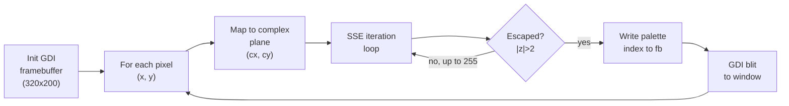
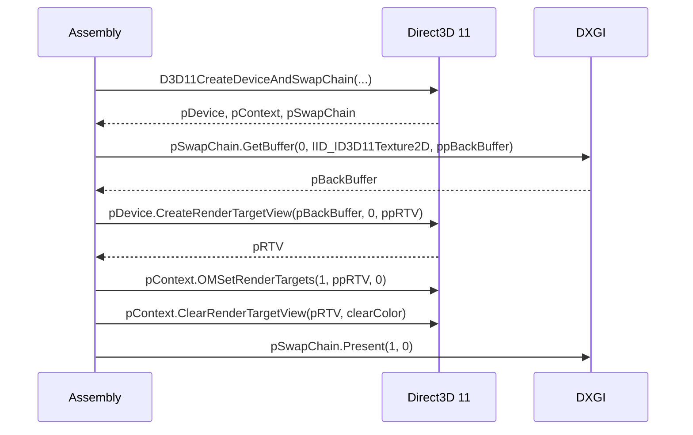

# Example Programs

All examples are in the `examples/` directory. Build any with:

```
was examples/<name>.was -o <name>.exe
<name>.exe
```

## Hello Exit (minimal)

The smallest useful program — exits with code 42:

```asm
.extern ExitProcess

.globl main
main:
    invoke ExitProcess, 42
```

`invoke` handles the Win64 shadow space, register placement, and call.
No prologue/epilogue needed because `ExitProcess` never returns.

## Mandelbrot (SSE double-precision)

`examples/mandel.was` — renders the Mandelbrot set in a GDI framebuffer,
saves to `mandel.bmp`.

### Key techniques



SSE inner loop (illustrative):

```asm
; xmm0 = zr, xmm1 = zi, xmm2 = cr, xmm3 = ci
.iter:
    movsd  xmm4, xmm0
    mulsd  xmm4, xmm4      ; zr*zr
    movsd  xmm5, xmm1
    mulsd  xmm5, xmm5      ; zi*zi
    movsd  xmm6, xmm4
    addsd  xmm6, xmm5      ; zr²+zi²
    ucomisd xmm6, [rip+four]  ; compare with 4.0
    jae    .escaped
    subsd  xmm4, xmm5      ; zr²-zi²
    addsd  xmm4, xmm2      ; new_zr = zr²-zi²+cr
    mulsd  xmm0, xmm1
    addsd  xmm0, xmm0      ; 2*zr*zi
    addsd  xmm0, xmm3      ; new_zi = 2*zr*zi+ci
    movsd  xmm0, xmm4
    dec    ecx
    jnz    .iter
```

This pattern — `ucomisd` + `jae` for the escape test — is idiomatic RASM FP.

## Julia Set

`examples/julia.was` — identical structure to Mandelbrot but with the complex
constant fixed at start (`c = -0.7 + 0.27015i`), iterating `z = z² + c` from
each pixel's position as the starting `z`.

## Game of Life

`examples/life.was` — double-buffered 320×200 pixel grid, runs Conway's
rules at each step, blits via GDI.

Key patterns:
- Two raw memory buffers swapped each frame (no heap allocations after init)
- Neighbour count with byte-sized loads; `cmp cl, 2` / `cmp cl, 3` for rules
- `rep stosd` to clear the next frame buffer

## D3D11 Mandelbrot (GPU)

`examples/mandel_gpu.was` — GPU-accelerated Mandelbrot using Direct3D 11
and a HLSL pixel shader. Features:
- COM setup for `D3D11CreateDeviceAndSwapChain`, `IDXGISwapChain`, `ID3D11Device`
- Rubber-band zoom (mouse drag to select region)
- HLSL shader embedded via `.ASCIISTRING`/`.ENDASCIISTRING`

### COM setup sequence



`comobj` / `comcall` handle all vtable dispatch and ABI marshaling.

## Direct2D Particle Fountain

`examples/d2d_balls.exe` — spinning particle simulation using Direct2D.

- Creates `ID2D1HwndRenderTarget` for hardware-accelerated drawing
- Each ball has `(x, y, vx, vy)` stored in packed arrays
- SSE `addps`/`mulps` updates positions in batches
- `ID2D1RenderTarget.FillEllipse` draws each ball

### SSE physics pattern

```asm
; Update 4 ball positions at once
movups  xmm0, [rip+posX]    ; load x[0..3]
movups  xmm1, [rip+velX]    ; load vx[0..3]
addps   xmm0, xmm1          ; x += vx
movups  [rip+posX], xmm0    ; store back
```

## Optimised proc example

`examples/mandel_gpu_proc.was` — same D3D11 Mandelbrot but refactored with
`proc`/`frame`/`endproc` conventions. Results in a 512-byte smaller binary
than the flat version because:

- `frame` procs share one aligned frame across all inner `call`s
- No per-call `sub rsp, 32` / `add rsp, 32` scaffolding
- `uses` list drives precise push/pop (no over-saving)

## Library modules

Reusable modules in `library/` — include with `.include "library/canvas.was"`:

| Module | What it provides |
|--------|-----------------|
| `blit.was` | GDI framebuffer blit primitives (DIB sections, `StretchBlt`) |
| `canvas.was` | Line, circle, rectangle, fill on indexed-colour framebuffer |
| `sprite.was` | Sprite blit with transparency and animation |
| `introspect.was` | Runtime type/layout introspection helpers |

### Using canvas

```asm
.include "library/canvas.was"
.include "library/blit.was"

.globl main
main:
    ; (canvas_init sets up 320x200 framebuffer, blit opens Win32 window)
    invoke canvas_init
    invoke blit_create_window, 320, 200

.main_loop:
    invoke canvas_clear, 0           ; fill with colour index 0
    invoke canvas_line, 10, 10, 310, 190, 15    ; draw line in colour 15
    invoke blit_frame                ; push framebuffer to screen
    jmp .main_loop
```
