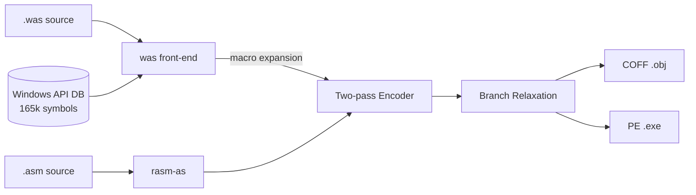

# RASM — x86-64 Windows Assembler

RASM is a self-contained x86-64 assembler for Windows. It accepts Intel-syntax
assembly text and produces byte-identical-to-LLVM machine code packaged as
linkable COFF `.obj` files or self-contained PE `.exe` executables — no
external linker required.



## Workspace Crates

| Crate | Binary | What it does |
|-------|--------|--------------|
| `rasm` | `rasm-as` | x86-64 encoder: Intel text → bytes, COFF and PE writers |
| `winkb` | `winkb` | Knowledge layer: query Windows API functions, types, constants |
| `was` | `was` | Windows front-end: `invoke`, `proc`, `comobj`, macros, symbol resolution |
| `ide` | `ide-card` | Render knowledge cards for registers, structs, procedures |
| `studio` | `studio` | Interactive IDE (requires `../WF66` Direct2D render core) |

## Documentation

| Page | What it covers |
|------|----------------|
| [Quick Start](quickstart.md) | Build, your first program, key command-line flags |
| [Language](language.md) | Registers, addressing modes, directives, condition codes |
| [Macros](macros.md) | `invoke`, `proc`/`frame`, `comobj`, `struct`, `.ASCIISTRING` |
| [Instructions](instructions.md) | Integer, SSE, AVX — all supported opcodes |
| [Windows API](windows-api.md) | Knowledge database, `winkb`, symbol resolution, COM |
| [Examples](examples.md) | Mandelbrot, Direct3D 11, Direct2D, game canvas demos |
| [Game Canvas Design](gamecanvas.md) | 320×200 indexed-colour framebuffer design |
| [Game Audio Design](gameaudio.md) | SFX synthesis and ABC/audio design |

## At a glance

- **Input** — Intel-syntax text with optional Windows-specific macros
- **Output** — COFF `.obj` (link with lld-link) or self-contained PE `.exe`
- **Encoding** — byte-identical to LLVM-MC; validated by 5,109 golden test forms
- **Knowledge** — 165,000 Windows API symbols resolved automatically in `was`
- **Macros** — `invoke` for Win64 ABI calls; `proc`/`frame` for subroutines; `comobj`/`comcall` for COM
- **SSE/AVX** — SSE2 scalar and packed; AVX/AVX2 VEX; AVX-512 EVEX
- **Diagnostics** — clobber detection, proc contract validation, `--check` live mode

## Quick build

```
cd E:\rasm
cargo build --release
cargo test -p rasm     # runs the 5,109-golden encoding corpus
```

Binaries land in `target\release\`.
