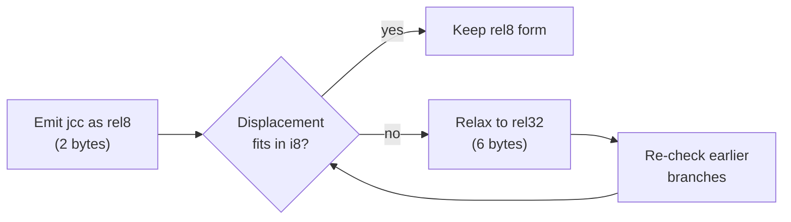
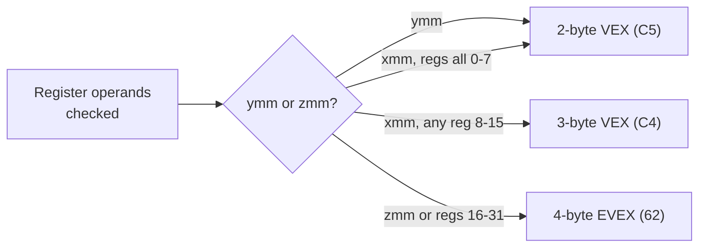

# Instruction Reference

All encodings are byte-identical to LLVM-MC. The 5,109-form golden corpus
validates every listed form at build time.

## Data movement

| Instruction | Forms | Notes |
|-------------|-------|-------|
| `mov` | `r/m, r` · `r, r/m` · `r, imm` · `m, imm` | All sizes 8/16/32/64 |
| `movabs` | `r64, imm64` | Always 10-byte; for 64-bit literals that don't fit imm32 |
| `movzx` | `r, r/m8` · `r, r/m16` | Zero-extend into 32/64-bit register |
| `movsx` | `r, r/m8` · `r, r/m16` | Sign-extend into 32/64-bit register |
| `movsxd` | `r64, r/m32` | Sign-extend 32-bit to 64-bit |
| `lea` | `r, [mem]` | Load effective address (no memory access) |
| `push` | `r64` · `imm` · `m64` | Decrements RSP by 8 first |
| `pop` | `r64` · `m64` | Increments RSP by 8 after |
| `xchg` | `r, r/m` · `r/m, r` | Atomic swap (implicit LOCK on memory forms) |
| `xadd` | `r/m, r` | Exchange and add (atomic-capable with LOCK) |
| `movbe` | `r, m` · `m, r` | Load/store with byte-order reversal |
| `bswap` | `r32` · `r64` | Byte-reverse in register |

## Arithmetic

| Instruction | Forms | Notes |
|-------------|-------|-------|
| `add` | `r/m, r` · `r, r/m` · `r/m, imm` | Sets CF, OF, ZF, SF, PF, AF |
| `sub` | same forms as `add` | |
| `adc` | same forms | Add with carry (CF) |
| `sbb` | same forms | Subtract with borrow (CF) |
| `cmp` | same forms | Subtract without storing result |
| `inc` | `r/m` | Increments; does not affect CF |
| `dec` | `r/m` | Decrements; does not affect CF |
| `neg` | `r/m` | Two's complement negate |
| `imul` | `r, r/m` · `r, r/m, imm` · `r/m` (1-op) | Signed multiply |
| `mul` | `r/m` | Unsigned multiply into `rdx:rax` |
| `idiv` | `r/m` | Signed divide `rdx:rax` ÷ operand |
| `div` | `r/m` | Unsigned divide |
| `cdqe` | — | Sign-extend EAX into RAX |
| `cdq` | — | Sign-extend EAX into EDX:EAX |
| `cqo` | — | Sign-extend RAX into RDX:RAX |

## Logical

| Instruction | Forms | Notes |
|-------------|-------|-------|
| `and` | `r/m, r` · `r, r/m` · `r/m, imm` | Bitwise AND; clears OF, CF |
| `or` | same | Bitwise OR |
| `xor` | same | Bitwise XOR; `xor eax, eax` is canonical zero |
| `not` | `r/m` | One's complement |
| `test` | `r/m, r` · `r/m, imm` | AND without storing; sets flags |

## Shift and rotate

| Instruction | Forms | Notes |
|-------------|-------|-------|
| `shl` / `sal` | `r/m, 1` · `r/m, cl` · `r/m, imm8` | Logical / arithmetic left shift |
| `shr` | same forms | Logical right shift (zero fill) |
| `sar` | same forms | Arithmetic right shift (sign fill) |
| `rol` | same forms | Rotate left |
| `ror` | same forms | Rotate right |
| `rcl` | same forms | Rotate left through carry |
| `rcr` | same forms | Rotate right through carry |

## Bit operations

| Instruction | Forms | Notes |
|-------------|-------|-------|
| `bt` | `r/m, r` · `r/m, imm8` | Bit test — copies bit to CF |
| `bts` | same | Bit test and set |
| `btr` | same | Bit test and reset |
| `btc` | same | Bit test and complement |
| `bsr` | `r, r/m` | Bit scan reverse (MSB index) |
| `bsf` | `r, r/m` | Bit scan forward (LSB index) |
| `popcnt` | `r, r/m` | Population count (number of 1 bits) |
| `lzcnt` | `r, r/m` | Leading zero count |
| `tzcnt` | `r, r/m` | Trailing zero count |

## Control flow

| Instruction | Forms | Notes |
|-------------|-------|-------|
| `jmp` | `rel32` · `r/m64` | Unconditional jump; auto-relaxes from rel8 |
| `jcc` | `rel8`/`rel32` | Conditional branch (see [condition codes](language.md)) |
| `call` | `rel32` · `r/m64` | Push return address, jump |
| `ret` | — | Pop return address, jump |
| `leave` | — | `mov rsp, rbp; pop rbp` |
| `syscall` | — | Kernel entry (Windows system calls) |
| `int3` | — | Debugger breakpoint |
| `int` | `imm8` | Software interrupt |
| `endbr64` | — | CET indirect branch tracking marker |
| `pause` | — | Spin-wait hint (avoids memory-order violations in loops) |

### Branch relaxation



`call` is always emitted as `rel32`. `jcc` and `jmp` start as `rel8` and
relax to `rel32` only when the displacement exceeds ±127 bytes. Converges
in a few iterations because branches only grow, never shrink.

## Condition codes — jcc / setcc / cmovcc

```asm
jz   .equal          ; jump if zero
setz al              ; set al to 1 if zero
cmovz rax, rbx      ; move rbx to rax if zero
```

All three families accept the same condition suffixes listed in the
[Language Reference](language.md#condition-codes).

## String operations

All have byte (b) and quad-word (q) variants; preceded by a repeat prefix:

| Prefix | Meaning |
|--------|---------|
| `rep` | Repeat CX times |
| `repe` / `repz` | Repeat while ZF=1 (use with `cmps`/`scas`) |
| `repne` / `repnz` | Repeat while ZF=0 |

| Instruction | What it does |
|-------------|-------------|
| `movsb` / `movsq` | Copy `[rsi]` → `[rdi]`; advance rsi, rdi by element size |
| `stosb` / `stosq` | Store `al`/`rax` → `[rdi]`; advance rdi |
| `lodsb` / `lodsq` | Load `[rsi]` → `al`/`rax`; advance rsi |
| `cmpsb` / `cmpsq` | Compare `[rsi]` vs `[rdi]`; advance both |
| `scasb` / `scasq` | Compare `al`/`rax` vs `[rdi]`; advance rdi |

## SSE / SSE2

### Scalar double-precision (F2 0F prefix)

| Instruction | What it does |
|-------------|-------------|
| `movsd xmm, xmm/m64` | Load scalar double |
| `addsd`, `subsd`, `mulsd`, `divsd` | Arithmetic |
| `sqrtsd` | Square root |
| `minsd`, `maxsd` | Min/max |
| `ucomisd` | Compare (sets ZF, CF; no exception on NaN) |
| `cvtsi2sd xmm, r/m` | Integer → double |
| `cvtsd2si r, xmm/m` | Double → integer (round) |
| `cvttsd2si r, xmm/m` | Double → integer (truncate) |
| `cvtsd2ss xmm, xmm/m` | Double → single |
| `cvtss2sd xmm, xmm/m` | Single → double |

### Scalar single-precision (F3 0F prefix)

Same naming pattern — replace `sd` with `ss`: `addss`, `subss`, `mulss`,
`divss`, `sqrtss`, `minss`, `maxss`, `movss`, `cvtsi2ss`, `cvtss2si`,
`cvttss2si`.

### Packed operations (all 128-bit xmm)

| Category | ps variants (float) | pd variants (double) |
|----------|--------------------|--------------------|
| Arithmetic | `addps subps mulps divps sqrtps` | `addpd subpd mulpd divpd sqrtpd` |
| Min/Max | `minps maxps` | `minpd maxpd` |
| Logical | `andps andnps orps xorps` | `andpd andnpd orpd xorpd` |
| Move | `movaps movups` | `movapd movupd` |
| Shuffle | `shufps imm8` | `shufpd imm8` |
| Unpack | `unpcklps unpckhps` | — |

### Packed integer (66 0F prefix)

`paddb paddw paddd paddq` — packed integer add (byte/word/dword/qword)
`psubb psubw psubd psubq` — packed integer subtract
`pmullw pmulld` — packed multiply low
`pand pandn por pxor` — packed logical
`pcmpeqb pcmpeqw pcmpeqd` — packed compare equal

## AVX / AVX2 (VEX-encoded)

VEX encoding extends most SSE instructions to 3-operand non-destructive form.
Prefixes: `v` added to the mnemonic; registers may be `xmm` (128-bit) or
`ymm` (256-bit).

### 3-operand (RVM: dest, src1, src2)

```asm
vaddps ymm0, ymm1, ymm2   ; ymm0 = ymm1 + ymm2 (256-bit)
vmulsd xmm0, xmm1, [rdi]  ; xmm0 = xmm1 * [rdi] (scalar double)
```

All packed variants: `vaddps/pd`, `vsubps/pd`, `vmulps/pd`, `vdivps/pd`,
`vmaxps/pd`, `vminps/pd`, `vsqrtps/pd`, `vaddss/sd`, `vmulss/sd`, etc.

Packed integer: `vpaddb`, `vpaddw`, `vpaddd`, `vpaddq`, `vpsubb` …
`vpmullw`, `vpmulld`, `vpand`, `vpor`, `vpxor`, `vpcmpeqb`, `vpcmpeqd`.

### 2-operand move and convert

```asm
vmovaps ymm0, [rdi]        ; aligned load (32-byte boundary)
vmovups [rdi], ymm0        ; unaligned store
vcvtdq2ps ymm0, ymm1       ; packed int32 → float32
vcvtps2dq ymm0, ymm1       ; packed float32 → int32 (round)
```

### VEX prefix selection



RASM selects the shortest valid encoding automatically. Commutative source
operands are swapped (LLVM-style) to keep high-numbered registers out of the
`rm` field, enabling 2-byte VEX when possible.

## Miscellaneous

| Instruction | Notes |
|-------------|-------|
| `cpuid` | CPU identification; eax/ebx/ecx/edx ← capabilities |
| `rdtsc` | Read time-stamp counter → edx:eax |
| `cmpxchg r/m, r` | Atomic compare-exchange (use with `LOCK` prefix) |
| `lahf` / `sahf` | Load/store AH ← flags |
| `cld` / `std` | Clear/set direction flag (for string ops) |
| `clc` / `stc` / `cmc` | Clear/set/complement carry |
| `nop` | Multi-byte NOP (LLVM canonical forms, never bare 0x90 for >1 byte) |
