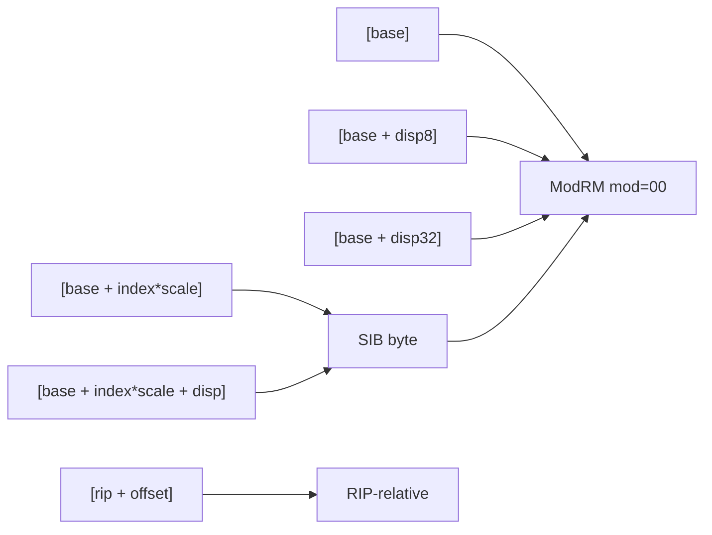

# Language Reference

RASM uses Intel syntax throughout. Comments use `;`. Labels end with `:`.

```asm
; This is a comment
main:                     ; label
    mov  rax, 1           ; instruction
    add  rax, qword [rdi] ; memory operand
```

## Registers

### General-purpose (64-bit)

| 64-bit | 32-bit | 16-bit | 8-bit (low) | Role (Win64 ABI) |
|--------|--------|--------|-------------|-------------------|
| `rax` | `eax` | `ax` | `al` | Return value; caller-saved |
| `rbx` | `ebx` | `bx` | `bl` | Callee-saved |
| `rcx` | `ecx` | `cx` | `cl` | Arg 1 (integer); caller-saved |
| `rdx` | `edx` | `dx` | `dl` | Arg 2 (integer); caller-saved |
| `rsi` | `esi` | `si` | `sil` | Callee-saved |
| `rdi` | `edi` | `di` | `dil` | Callee-saved |
| `rsp` | `esp` | `sp` | `spl` | Stack pointer |
| `rbp` | `ebp` | `bp` | `bpl` | Callee-saved (frame base) |
| `r8` | `r8d` | `r8w` | `r8b` | Arg 3 (integer); caller-saved |
| `r9` | `r9d` | `r9w` | `r9b` | Arg 4 (integer); caller-saved |
| `r10` | `r10d` | `r10w` | `r10b` | Caller-saved |
| `r11` | `r11d` | `r11w` | `r11b` | Caller-saved |
| `r12`–`r15` | `r12d`–`r15d` | `r12w`–`r15w` | `r12b`–`r15b` | Callee-saved |

### SIMD registers

| Name | Width | Use |
|------|-------|-----|
| `xmm0`–`xmm15` | 128-bit | SSE/SSE2 scalar and packed; xmm0–xmm3 = float args/ret (Win64) |
| `ymm0`–`ymm15` | 256-bit | AVX/AVX2 (VEX-encoded) |
| `zmm0`–`zmm31` | 512-bit | AVX-512 (EVEX-encoded) |

## Addressing modes



| Form | Example | Notes |
|------|---------|-------|
| Register | `rax` | Direct register operand |
| Immediate | `42`, `0x2A`, `-1` | Integer literal |
| Indirect | `[rdi]` | Memory at address in register |
| Based | `[rdi + 8]` | Register plus displacement |
| Indexed | `[rdi + rcx*8]` | Base + index × scale (scale: 1, 2, 4, 8) |
| Full | `[rdi + rcx*4 + 16]` | Base + scaled index + displacement |
| RIP-relative | `[rip + sym]` | PC-relative symbol access |
| Absolute | `[0x10000]` | Fixed address (rare on Windows) |

### Size overrides

Placed before `[...]` when the size cannot be inferred from registers:

```asm
mov  byte  ptr [rdi], 0xFF
mov  word  ptr [rdi], 0x1234
mov  dword ptr [rdi], 0xDEAD
mov  qword ptr [rdi], rax
```

## Directives

### Section control

```asm
.text              ; code section (read + execute)
.data              ; initialised data (read + write)
.bss               ; uninitialised data (zeroed at load)
```

### Symbol declarations

```asm
.globl  main         ; export label to linker
.extern CreateFileW  ; import external symbol
```

### Data emission

```asm
.byte   0x90              ; 1-byte literal
.word   0x1234            ; 2-byte little-endian
.dword  0xDEADBEEF        ; 4-byte little-endian
.qword  0xCAFEBABEDEAD    ; 8-byte little-endian
.space  256               ; reserve 256 zero bytes
.ascii  "hello"           ; raw bytes (no null terminator)
.asciz  "hello"           ; null-terminated string
```

### Include

```asm
.include "library/canvas.was"   ; insert another source file here
```

### WAS-only: ASCII block

```asm
.ASCIISTRING
float4 main(float2 uv : TEXCOORD) : SV_Target {
    return float4(uv, 0, 1);
}
.ENDASCIISTRING
```

Used to embed HLSL or other text blobs as raw byte sequences in the data section.

## Condition codes

Used by `jcc`, `setcc`, and `cmovcc`:

| Code | Aliases | Condition | Flags |
|------|---------|-----------|-------|
| `o` | — | Overflow | OF=1 |
| `no` | — | No overflow | OF=0 |
| `b` | `c`, `nae` | Below (unsigned) | CF=1 |
| `ae` | `nb`, `nc` | Above or equal | CF=0 |
| `e` | `z` | Equal / zero | ZF=1 |
| `ne` | `nz` | Not equal | ZF=0 |
| `be` | `na` | Below or equal | CF=1 or ZF=1 |
| `a` | `nbe` | Above (unsigned) | CF=0 and ZF=0 |
| `s` | — | Sign (negative) | SF=1 |
| `ns` | — | No sign | SF=0 |
| `p` | `pe` | Parity even | PF=1 |
| `np` | `po` | Parity odd | PF=0 |
| `l` | `nge` | Less than (signed) | SF≠OF |
| `ge` | `nl` | Greater or equal | SF=OF |
| `le` | `ng` | Less or equal | ZF=1 or SF≠OF |
| `g` | `nle` | Greater (signed) | ZF=0 and SF=OF |

Example:

```asm
    cmp  rax, rbx
    jge  .gt_or_eq       ; jump if rax >= rbx (signed)
    setb cl              ; set cl to 1 if below (unsigned)
    cmovl rax, rdx      ; move rdx to rax if less (signed)
```
