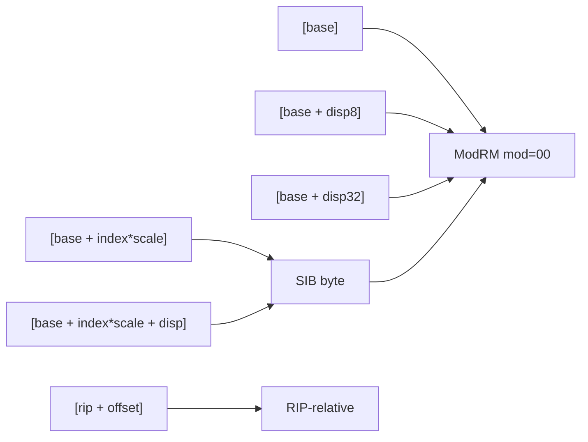

# Language Reference

RASM uses Intel syntax throughout. Comments use `;`. Labels end with `:`.

```asm
; This is a comment
main:                     ; label
    mov  rax, 1           ; instruction
    add  rax, qword [rdi] ; memory operand
```

## Registers

### General-purpose (64-bit)

| 64-bit | 32-bit | 16-bit | 8-bit (low) | Role (Win64 ABI) |
|--------|--------|--------|-------------|-------------------|
| `rax` | `eax` | `ax` | `al` | Return value; caller-saved |
| `rbx` | `ebx` | `bx` | `bl` | Callee-saved |
| `rcx` | `ecx` | `cx` | `cl` | Arg 1 (integer); caller-saved |
| `rdx` | `edx` | `dx` | `dl` | Arg 2 (integer); caller-saved |
| `rsi` | `esi` | `si` | `sil` | Callee-saved |
| `rdi` | `edi` | `di` | `dil` | Callee-saved |
| `rsp` | `esp` | `sp` | `spl` | Stack pointer |
| `rbp` | `ebp` | `bp` | `bpl` | Callee-saved (frame base) |
| `r8` | `r8d` | `r8w` | `r8b` | Arg 3 (integer); caller-saved |
| `r9` | `r9d` | `r9w` | `r9b` | Arg 4 (integer); caller-saved |
| `r10` | `r10d` | `r10w` | `r10b` | Caller-saved |
| `r11` | `r11d` | `r11w` | `r11b` | Caller-saved |
| `r12`–`r15` | `r12d`–`r15d` | `r12w`–`r15w` | `r12b`–`r15b` | Callee-saved |

### SIMD registers

| Name | Width | Use |
|------|-------|-----|
| `xmm0`–`xmm15` | 128-bit | SSE/SSE2 scalar and packed; xmm0–xmm3 = float args/ret (Win64) |
| `ymm0`–`ymm15` | 256-bit | AVX/AVX2 (VEX-encoded) |
| `zmm0`–`zmm31` | 512-bit | AVX-512 (EVEX-encoded) |

## Addressing modes



| Form | Example | Notes |
|------|---------|-------|
| Register | `rax` | Direct register operand |
| Immediate | `42`, `0x2A`, `-1` | Integer literal |
| Indirect | `[rdi]` | Memory at address in register |
| Based | `[rdi + 8]` | Register plus displacement |
| Indexed | `[rdi + rcx*8]` | Base + index × scale (scale: 1, 2, 4, 8) |
| Full | `[rdi + rcx*4 + 16]` | Base + scaled index + displacement |
| RIP-relative | `[rip + sym]` | PC-relative symbol access |
| Absolute | `[0x10000]` | Fixed address (rare on Windows) |

### Size overrides

Placed before `[...]` when the size cannot be inferred from registers:

```asm
mov  byte  ptr [rdi], 0xFF
mov  word  ptr [rdi], 0x1234
mov  dword ptr [rdi], 0xDEAD
mov  qword ptr [rdi], rax
```

## Directives

The `was` front-end uses **MASM-style** sections and data directives. (The bare
`rasm-as` encoder underneath is GAS-flavored; everything below is the `was`
dialect that `.was` files are written in.)

### Sections

```asm
.CODE        ; code — read + execute   (aliases: .text / .code)
.DATA        ; initialised data — read + write   (alias: .data)
```

Directive names are case-insensitive (`.DATA` == `.data`). Export a label with
`.globl` (alias `.global`); symbols referenced by `invoke` are resolved from the
knowledge database automatically — no manual `.extern` is needed.

```asm
.globl  main
```

### Data emission (MASM-style)

```asm
label   BYTE   0x90, 1, 2        ; 1-byte values      (aliases: SBYTE, DB)
        WORD   0x1234            ; 2-byte LE           (SWORD,  DW)
        DWORD  0xDEADBEEF        ; 4-byte LE           (SDWORD, DD)
        QWORD  0xCAFEBABEDEAD    ; 8-byte LE           (SQWORD, DQ)
msg     WCHAR  "Hello", 0        ; UTF-16 string + terminator
buf     BYTE   256 dup(0)        ; 256 zero bytes (dup repeats a value)
slot    DWORD  ?                 ; ? = one zero-filled element
freq    real8  440.0            ; IEEE-754 f64        (real4 / f32 for 32-bit)
```

- `"…"` is a string; under `WCHAR` it is encoded UTF-16. `N dup(v)` repeats `v`
  `N` times — the count folds through equates (see below). `?` reserves a single
  zeroed element of the directive's width.
- **`.DATA` is byte-packed — there is no automatic alignment.** An odd-length
  declaration shifts every following symbol by a byte, which can misalign a
  structure the OS or an SSE load reads. Put `.balign 16` at the head of a `.DATA`
  block. Alignment directives are GAS-style, **with the dot** (`.align`,
  `.balign`, `.p2align`); a bare `align` is parsed as an instruction. See
  `help.md` trap #8.

### Equates & conditional assembly

`NAME equ <expr>` (or `NAME = <expr>`) defines a compile-time integer that folds
to a literal; `IF` / `IFDEF` / `IFNDEF` / `ELSEIF` / `ELSE` / `ENDIF` select code
at assembly time. See **[Macros → Equates](macros.md#equates--compile-time-constants)**
for the expression grammar and substitution rules.

### Structured control flow

`.if/.elseif/.else/.endif`, `.while/.endw`, `.repeat/.until`,
`.for reg = a to b/.endfor`, `.forever/.endfor`, and `.break`/`.continue`/`.ret`
lower to visible `cmp` + `jcc`. A condition is `reg <relop> value` (`<  <=  >  >=
==  !=`, unsigned by default; `s`-prefix for signed). See
**[Macros → Structured control flow](macros.md#structured-control-flow-runtime)**.

### Include & ASCII blocks

```asm
.include "library/canvas.was"   ; insert another file (path relative to this one)

.ASCIISTRING                    ; embed raw text (HLSL, etc.) as bytes
float4 main(float2 uv : TEXCOORD) : SV_Target { return float4(uv, 0, 1); }
.ENDASCIISTRING
```

## Condition codes

Used by `jcc`, `setcc`, and `cmovcc`:

| Code | Aliases | Condition | Flags |
|------|---------|-----------|-------|
| `o` | — | Overflow | OF=1 |
| `no` | — | No overflow | OF=0 |
| `b` | `c`, `nae` | Below (unsigned) | CF=1 |
| `ae` | `nb`, `nc` | Above or equal | CF=0 |
| `e` | `z` | Equal / zero | ZF=1 |
| `ne` | `nz` | Not equal | ZF=0 |
| `be` | `na` | Below or equal | CF=1 or ZF=1 |
| `a` | `nbe` | Above (unsigned) | CF=0 and ZF=0 |
| `s` | — | Sign (negative) | SF=1 |
| `ns` | — | No sign | SF=0 |
| `p` | `pe` | Parity even | PF=1 |
| `np` | `po` | Parity odd | PF=0 |
| `l` | `nge` | Less than (signed) | SF≠OF |
| `ge` | `nl` | Greater or equal | SF=OF |
| `le` | `ng` | Less or equal | ZF=1 or SF≠OF |
| `g` | `nle` | Greater (signed) | ZF=0 and SF=OF |

Example:

```asm
    cmp  rax, rbx
    jge  .gt_or_eq       ; jump if rax >= rbx (signed)
    setb cl              ; set cl to 1 if below (unsigned)
    cmovl rax, rdx      ; move rdx to rax if less (signed)
```
