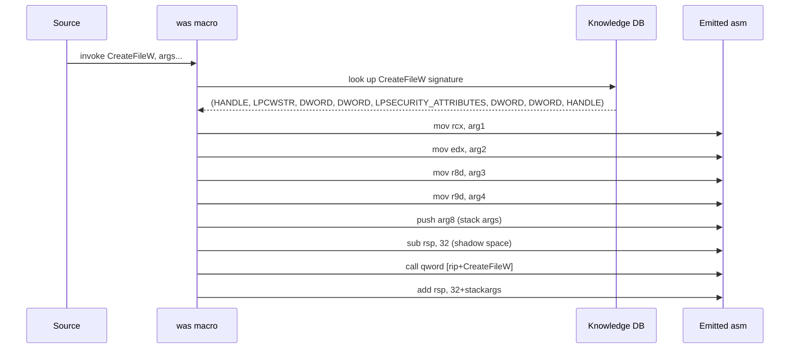
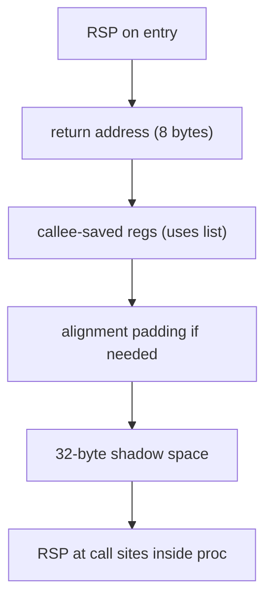
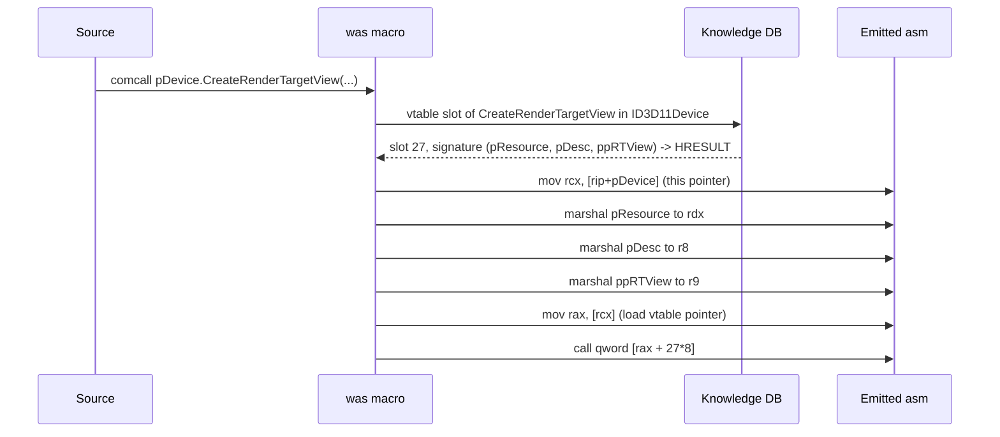

# Macros — the WAS Front-End

The `was` front-end extends Intel-syntax assembly with macros that expand to
visible instructions before encoding. `--emit-asm` always shows the expanded
form — there is no hidden codegen.

## invoke

Calls a Windows API function with Win64 ABI marshaling.

```asm
invoke CreateFileW, lpFileName, GENERIC_READ, FILE_SHARE_READ, 0, OPEN_EXISTING, 0, 0
```

Expansion sequence:



Win64 ABI rules applied automatically:

- First four integer/pointer args → `rcx`, `rdx`, `r8`, `r9`
- Float args → `xmm0`–`xmm3` (detected from parameter type in knowledge base)
- Additional args pushed right-to-left
- 32-byte shadow space reserved and cleaned
- Stack aligned to 16 bytes at the call site

## proc / endproc

Declares a subroutine with an explicit register contract.

```asm
proc  DrawLine  uses rsi rdi rbx  in rcx rdx r8 r9
    ; rcx = x1, rdx = y1, r8 = x2, r9 = y2
    ; rbx, rsi, rdi used internally — saved/restored automatically
    mov  rsi, rcx
    ...
endproc
```

### Clause meanings

| Clause | What it declares |
|--------|-----------------|
| `uses r1 r2 …` | Callee-saved registers modified in the body (push/pop emitted) |
| `in r1 r2 …` | Registers that carry input — must be set by caller |
| `out r1 r2 …` | Registers that carry output — must be written in the body |
| `frame` | One-time stack alignment; all `call`s inside use the aligned frame |

### Stack frame layout (with `frame`)



Without `frame`, each inner `call` inside the proc must manage its own
alignment. With `frame`, the proc's prologue aligns once; inner calls sit
at the correct 16-byte boundary automatically. `--check` validates this.

### Proc contract checking

```
was myprog.was --check
```

| Diagnostic | Triggered when |
|------------|---------------|
| `register modified but not in uses:` | Callee-saved reg written without declaration |
| `clobber: value in %rcx lost across call` | Volatile reg overwritten before save |
| `register declared in: but never read` | Declared input never used |
| `register declared out: but never written` | Promised output missing |

## comobj / comcall

Declare a COM interface variable and call its methods.

```asm
comobj  pDevice : ID3D11Device

; Call CreateRenderTargetView
comcall pDevice.CreateRenderTargetView(pTexture, 0, pRTV)
```

Expansion:



Float parameters are automatically routed to `xmm` registers based on the
method's signature in the knowledge base.

## struct

Declare a struct instance with named-field initializers:

```asm
struct  wndClass  WNDCLASSEXW  cbSize=sizeof(WNDCLASSEXW), style=CS_HREDRAW, lpfnWndProc=WndProc, ends
```

Fields not listed are zero-initialized. `ends` closes the declaration.
Field names resolve to byte offsets via the knowledge base:

```asm
; WNDCLASSEXW.cbSize is at offset 0, .style at offset 4, etc.
mov dword [rbx + WNDCLASSEXW.cbSize], 48
```

`sizeof(Type)` returns the size in bytes of any type in the knowledge base:

```asm
mov eax, sizeof(RECT)      ; = 16
mov eax, sizeof(POINT)     ; = 8
```

## iid

Embed a COM interface GUID as a 16-byte literal:

```asm
iid  IID_ID3D11Device   ; emits the 16-byte GUID from the database
```

## Equates — compile-time constants

`NAME equ <expr>` (or `NAME = <expr>` outside a `struct` block) binds a name to an
integer that **folds to a literal** before anything is lowered. The definition
line emits nothing; every later whole-word use of the name is replaced by its
value — in operands, data values, `dup` counts, and `struct` field values.
Substitution never reaches inside a `"…"` string or a comment, and never rewrites
a substring of a longer identifier.

```asm
TILE     equ 16
COLS     equ 20
CELLS    equ TILE * COLS            ; define-before-use: references earlier equates
MASK     equ MB_OK | MB_ICONERROR   ; winkb constants resolve too

    mov  eax, CELLS                 ; → mov eax, 320   (visible in --emit-asm)
    and  ebx, TILE - 1
buf BYTE CELLS dup(0)               ; the dup count folds (trap #5 retired)
```

`<expr>` is a C-shaped integer expression — literals (decimal / `0x`-hex,
underscores allowed), earlier equates, and winkb constants — with operators
(high → low precedence): unary `-` `~`; `* / %`; `+ -`; `<< >>`; `&`; `^`; `|`,
and parentheses. An identifier that is neither an equate nor a known constant is a
hard error: a compile-time value must be fully known.

> Equates are defined in one global preprocessing pass over the whole `.include`
> stream, so a constant defined in a library module is visible to every file
> included after it (define-before-use) — that is how a game can name the
> library's limits.

## Conditional assembly — `IF` (compile-time) vs `.if` (runtime)

Undotted, MASM-style, selected **at assembly time** — excluded lines produce no
output and define no equates:

```asm
DBG equ 1
IF DBG
    invoke OutputDebugStringA, msg
ELSEIF OTHER
    …
ELSE
    …
ENDIF

IFDEF  FEATURE      ; taken when FEATURE is in the equate table
IFNDEF FEATURE      ; …or when it is not
```

`IF` / `IFDEF` / `IFNDEF` / `ELSEIF` / `ELSE` / `ENDIF` nest. This is entirely
distinct from the **runtime** dotted `.if` below: undotted `IF` chooses *whether
code exists*; dotted `.if` chooses *what the code does each time it runs*.

## Structured control flow (runtime)

Dotted, block-structured wrappers that lower to a visible `cmp` + `jcc` (and the
back edges) — the body and the branch are exactly what you'd hand-write:

| construct | form |
|---|---|
| if / else | `.if c` … `.elseif c` … `.else` … `.endif` |
| while | `.while c` … `.endw` |
| do-until | `.repeat` … `.until c` |
| counted for | `.for reg = start to end` … `.endfor` |
| infinite | `.forever` … `.endfor` |
| early exits | `.break [if c]`, `.continue [if c]`, `.ret` |

A **condition** is `reg <relop> value`, relop ∈ `<  <=  >  >=  ==  !=`. Comparisons
are **unsigned by default**; prefix the operator with `s` for signed (`s<`, `s<=`,
`s>`, `s>=`). Equality is sign-agnostic. The value resolves like any operand, so a
constant, equate, or char literal works.

```asm
    .for ecx = 0 to COLS - 1        ; cmp/ja + inc ecx each pass
        movzx eax, byte ptr [rsi + rcx]
        .if al == 0
            .continue               ; skip transparent cells
        .endif
        call DrawCell
    .endfor
```

`.for` counts **up by one** with an unsigned compare (`cmp reg, end; ja …end`),
so `start ≤ end`. `.forever` only leaves via `.break`. Inside a `proc`, `.ret`
(or a bare `ret`) runs the epilogue first, so the saved registers and frame are
always released.

## Float data — real4 / real8

`real4`/`f32` and `real8`/`f64` take **decimal float literals** and emit the
IEEE-754 bit pattern, so float constants stay readable instead of hand-computed
hex:

```asm
freq   real8 440.0          ; 8 bytes: the IEEE-754 pattern for 440.0
gain   real4 0.5
```

Pass one to `invoke` with the same keyword so it marshals to an `xmm` register:
`invoke f, real8 [rip + freq]` (trap #4).

## .ASCIISTRING / .ENDASCIISTRING

Embed raw ASCII text in the data section (used for HLSL shader source):

```asm
shaderSrc:
.ASCIISTRING
cbuffer cb : register(b0) {
    float4x4 worldViewProj;
};
float4 VSMain(float3 pos : POSITION) : SV_POSITION {
    return mul(worldViewProj, float4(pos, 1));
}
.ENDASCIISTRING
shaderSrcEnd:
```

Length = `shaderSrcEnd - shaderSrc`.

## .include

Include another source file at the point of the directive:

```asm
.include "library/canvas.was"
.include "library/blit.was"
```

Paths are resolved relative to the file containing the `.include`.
