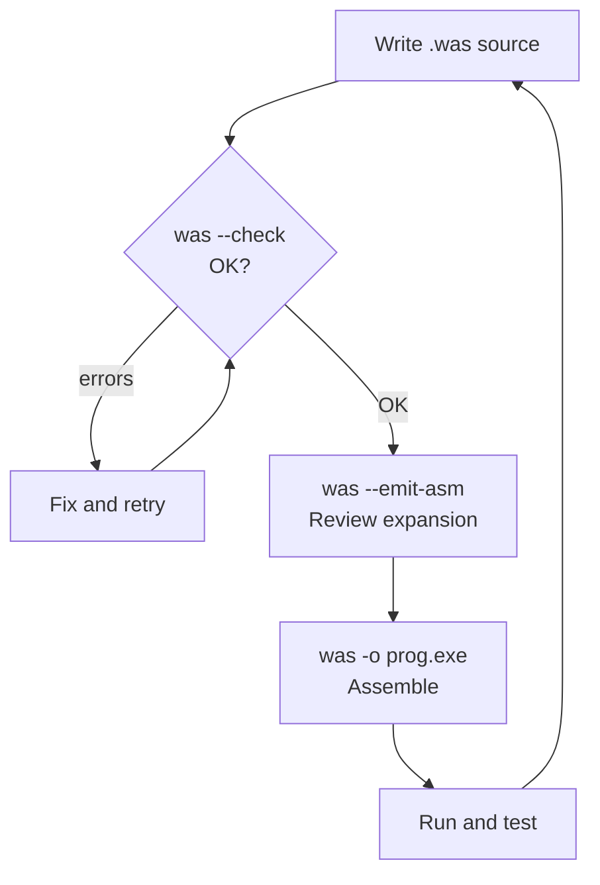

# Quick Start

## Prerequisites

- Rust (stable, 1.95+) — install from [rustup.rs](https://rustup.rs)
- Windows 10 or 11 x64

## Build

```
cd E:\rasm
cargo build --release
```

Default workspace members (`rasm`, `winkb`, `was`, `ide`) all build together.
`studio` is excluded by default (it requires `../WF66`).

Binaries are written to `target\release\`:

| Binary | Purpose |
|--------|---------|
| `rasm-as.exe` | Bare encoder — Intel syntax to COFF `.obj` |
| `was.exe` | Windows front-end — macros, Win64 ABI, PE output |
| `winkb.exe` | Query the Windows API knowledge base |
| `ide-card.exe` | Render a knowledge card for a type, register, or function |

## Your first program

Create `hello.was`:

```asm
.extern ExitProcess

.globl main
main:
    invoke ExitProcess, 42
```

`invoke` is a macro that expands to the Win64 ABI call sequence (shadow space,
register marshaling, alignment). The knowledge base supplies the function
signature automatically.

Assemble and run:

```
was hello.was -o hello.exe
hello.exe
echo Exit code: %errorlevel%
```

Exit code will be `42`.

## Key flags

```
was  <input.was>  [options]
```

| Flag | What it does |
|------|-------------|
| `-o <file>` | Output file (`.exe` for PE, `.obj` for COFF) |
| `--emit-asm` | Print expanded Intel asm before encoding (shows macro output) |
| `--check` | Validate macros, contracts, and symbol resolution without assembling |
| `--list-symbols` | Dump all known labels and extern references |

For the bare encoder (no macros):

```
rasm-as  <input.asm>  -o output.obj
```

## The assembly loop



## Seeing macro expansion

`--emit-asm` shows the raw Intel instructions that the macro system emits
before encoding. This is the key diagnostic tool:

```
was hello.was --emit-asm
```

Output (example):

```asm
; invoke ExitProcess, 42 expands to:
mov  ecx, 42
sub  rsp, 32          ; shadow space
call qword [rip+ExitProcess]
add  rsp, 32
```

## Checking proc contracts

When you use `proc`/`frame`, `--check` validates the register contract:

```
was myprog.was --check
```

Errors reported:

| Error | Meaning |
|-------|---------|
| `register modified but not in uses` | Callee-saved register modified without declaring it |
| `register read but not in in:` | Input register used but not declared |
| `register declared out: but never written` | Promised output never produced |
| `call inside frame: stack not aligned` | Stray `push`/`sub rsp` broke frame alignment |

## Testing the encoder

```
cargo test -p rasm
```

Runs 5,109 golden forms against the encoding corpus — byte-exact match to
LLVM-MC on every form is required to pass.
