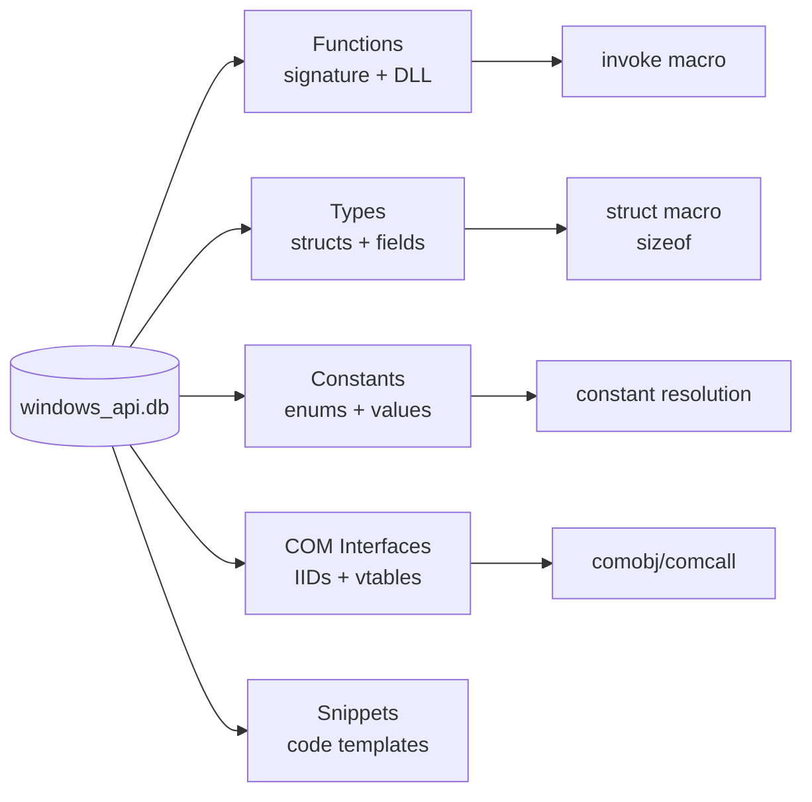
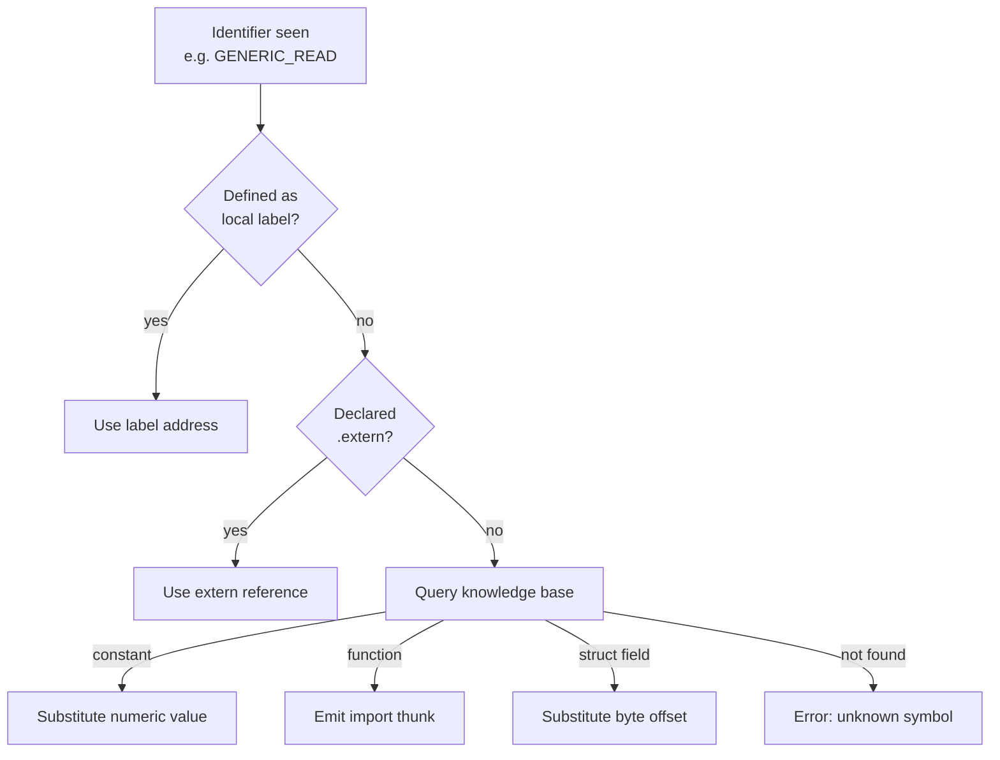

# Windows API Integration

The `winkb` crate provides a SQLite knowledge base of ~165,000 Windows API
symbols. The `was` front-end queries it automatically when resolving identifiers
that aren't local labels or extern declarations.

## What the database contains



Coverage includes:

- Win32 API (kernel32, user32, gdi32, advapi32, ntdll, …)
- DirectX (Direct3D 9/10/11/12, Direct2D, DXGI, DirectWrite)
- COM interfaces (IUnknown tree, GUID/IID table, vtable layouts)
- C runtime (msvcrt — malloc, free, printf, …)
- Struct layouts (byte offsets of every field, total size)
- Enum values (GENERIC_READ, FILE_SHARE_READ, OPEN_EXISTING, …)

## Database location

Default path: `E:\windows_api\windows_api.db`

Override with the environment variable:

```
$env:WINKB_DB = "D:\myproject\windows_api.db"
```

## winkb CLI

Query the database from the command line:

```
winkb show <name>           # function, type, or constant
winkb fields <StructName>   # struct field offsets
winkb iid <InterfaceName>   # COM interface GUID
winkb search <query>        # fuzzy search (handles typos)
```

### Examples

```
winkb show CreateFileW
```
Output:
```
HANDLE CreateFileW(
  LPCWSTR lpFileName,       rcx (pointer)
  DWORD   dwDesiredAccess,  edx (dword)
  DWORD   dwShareMode,      r8d (dword)
  LPSECURITY_ATTRIBUTES lpSecurityAttributes, r9 (pointer)
  DWORD   dwCreationDisposition,  [rsp+32] (dword)
  DWORD   dwFlagsAndAttributes,   [rsp+40] (dword)
  HANDLE  hTemplateFile           [rsp+48] (pointer)
) from kernel32.dll
```

```
winkb fields BITMAPINFOHEADER
```
Output:
```
BITMAPINFOHEADER (40 bytes)
  +0  biSize          DWORD
  +4  biWidth         LONG
  +8  biHeight        LONG
  +12 biPlanes        WORD
  +14 biBitCount      WORD
  +16 biCompression   DWORD
  +20 biSizeImage     DWORD
  +24 biXPelsPerMeter LONG
  +28 biYPelsPerMeter LONG
  +32 biClrUsed       DWORD
  +36 biClrImportant  DWORD
```

```
winkb iid ID3D11Device
```
Output:
```
ID3D11Device {db6f6ddb-ac77-4e88-8253-819df9bbf140}
vtable: 43 methods
  [0]  QueryInterface(REFIID, void**)
  [1]  AddRef()
  ...
  [12] CreateRenderTargetView(...)
```

## Symbol resolution in was

When `was` encounters an identifier it doesn't recognise as a local label or
`.extern`, it queries the knowledge base:



This means you rarely need explicit `.extern` declarations or numeric constant
lookups — write `GENERIC_READ`, `FILE_SHARE_READ`, `OPEN_EXISTING` directly
and `was` resolves them.

## IDE cards

The `ide` crate renders knowledge as formatted Markdown cards for the IDE
assistant pane:

```
ide-card CreateFileW       # function card
ide-card RECT              # struct card
ide-card rcx               # register card
ide-card ID3D11Device      # COM interface card
```

These cards are what the `studio` IDE displays in its knowledge pane when you
hover over an identifier.

## COM workflow

```asm
; Declare the COM object variable
comobj  pFactory : IDXGIFactory

; Call QueryInterface
comcall pFactory.QueryInterface(IID_IDXGIFactory1, ppFactory1)

; GUID constant
iid     IID_IDXGIFactory1
```

The sequence `comobj` → `comcall` → `iid` fully encapsulates COM:
- `comobj` reserves space for the interface pointer (a `qword`)
- `comcall` marshals arguments, loads the vtable, and calls the slot
- `iid` emits the 16-byte GUID literal
- Float parameters in method signatures are routed to `xmm` registers automatically

## Fuzzy search

The knowledge base includes a `SOUNDEX`-style fuzzy matcher for typos:

```
winkb search CreateFileWide
; Suggestions: CreateFileW, CreateFileA
```

Error messages from `--check` include "Did you mean?" suggestions when a
symbol name is close to a known one.
